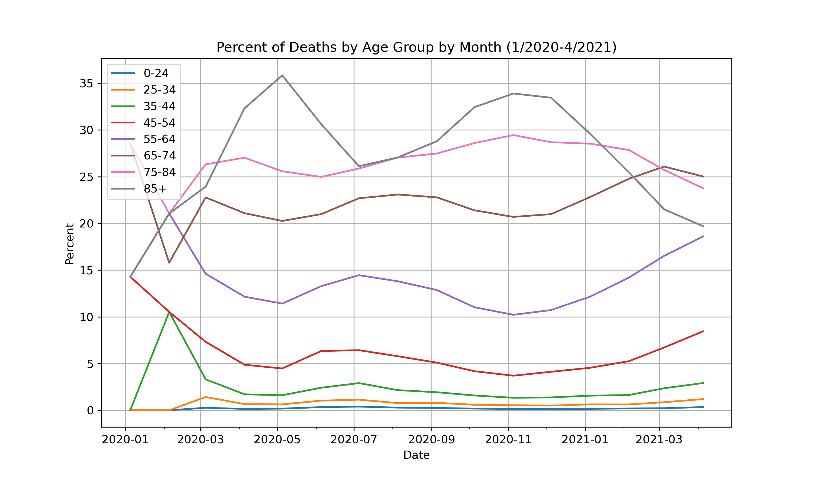
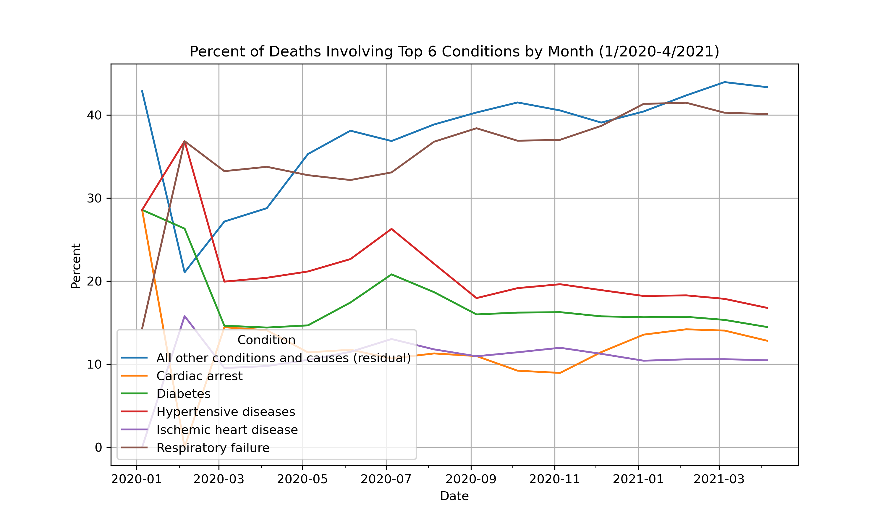
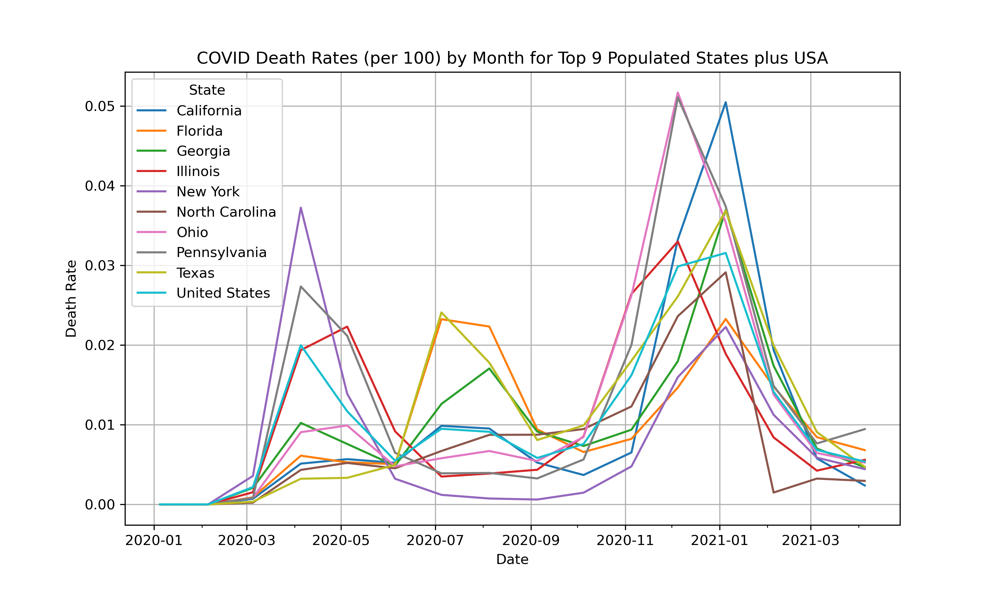
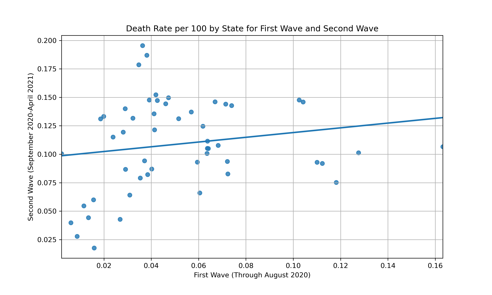
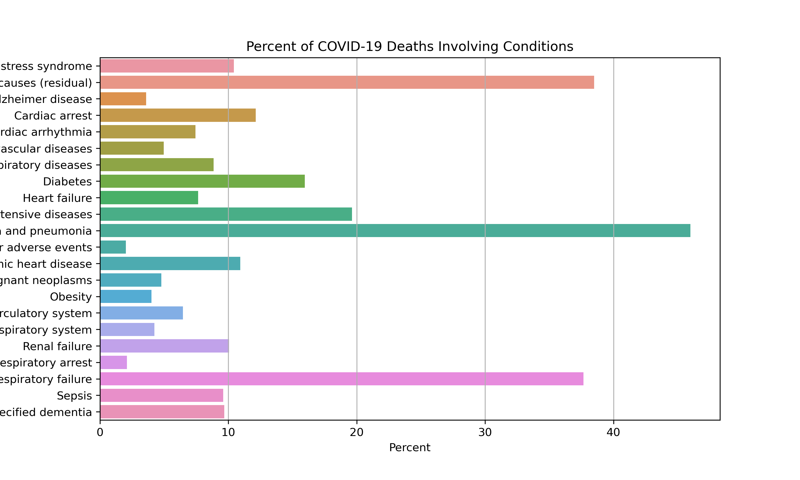
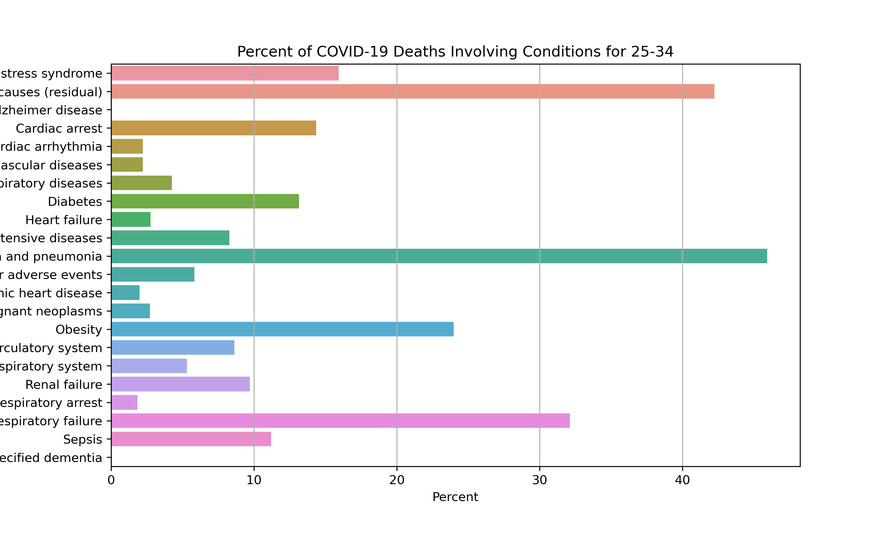
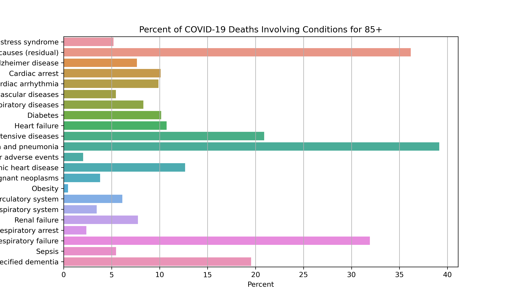
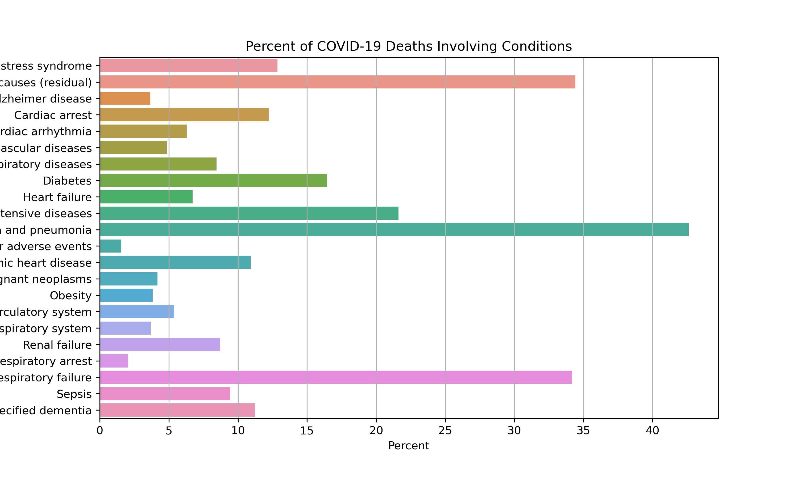

---
output:
  pdf_document: default
  html_document: default
---

# Appendix

All relevant figures are included here. These plots are very high resolution (300 dpi), much higher resolution than ones in the Jupyter Notebook file (Midterm_Project.ipynb). 

Some chart not formatted correctly. Can be found on https://github.com/WilliamShih9/STA160-2021/tree/main/PlotsFinalProject

.png)

\newpage

\clearpage

.png)

.png)

.png)

.png)

\newpage

\clearpage

 COVID-19 Deaths.png)

 Pneumonia Deaths.png)

 Pneumonia, Influenza, or COVID-19 Deaths.png)

 COVID-19 Deaths.png)

 Pneumonia Deaths.png)

 Pneumonia, Influenza, or COVID-19 Deaths.png)

 COVID-19 Deaths.png)

 Pneumonia Deaths.png)

 Pneumonia, Influenza, or COVID-19 Deaths.png)

 COVID-19 Deaths.png)

 Pneumonia Deaths.png)

 Pneumonia, Influenza, or COVID-19 Deaths.png)

\newpage

 COVID-19 Deaths.png)

 Pneumonia Deaths.png)

 Pneumonia, Influenza, or COVID-19 Deaths.png)

 COVID-19 Deaths.png)

 Pneumonia Deaths.png)

 Pneumonia, Influenza, or COVID-19 Deaths.png)

 COVID-19 Deaths.png)

 Pneumonia Deaths.png)

 Pneumonia, Influenza, or COVID-19 Deaths.png)

 COVID-19 Deaths.png)

 Pneumonia Deaths.png)

 Pneumonia, Influenza, or COVID-19 Deaths.png)

\clearpage

.png)

.png)

.png)

.png)

.png)

.png)

.png)

.png)

\clearpage

 vs Overall Death Rate.png)

.png)

.png)

.png)

\newpage

.png)

.png)

.png)

.png)

.png)

.png)

.png)

.png)

\newpage

.png)

.png)

.png)

.png)

.png)

.png)

.png)

.png)

\newpage

 vs Overall Death Rate.png)

.png)

.png)

.png)

.png)

.png)

.png)

.png)

.png)

.png)

.png)

.png)

\newpage

\clearpage

.png)

.png)

.png)

.png)

\newpage

.png)

.png)

.png)

.png)

.png)

.png)

.png)

.png)

\newpage

\clearpage

.png)

.png)

.png)

.png)

.png)

.png)

.png)

.png)
