---
output:
  pdf_document: default
  html_document: default
---
# 8. Appendix

All relevant figures are included here and some are also in main text, but the ones in the appendix are higher resolution. This summarizes the all the output from the .ipynb file to high-definition images and is also grouped together by type of graph instead of by regression method.

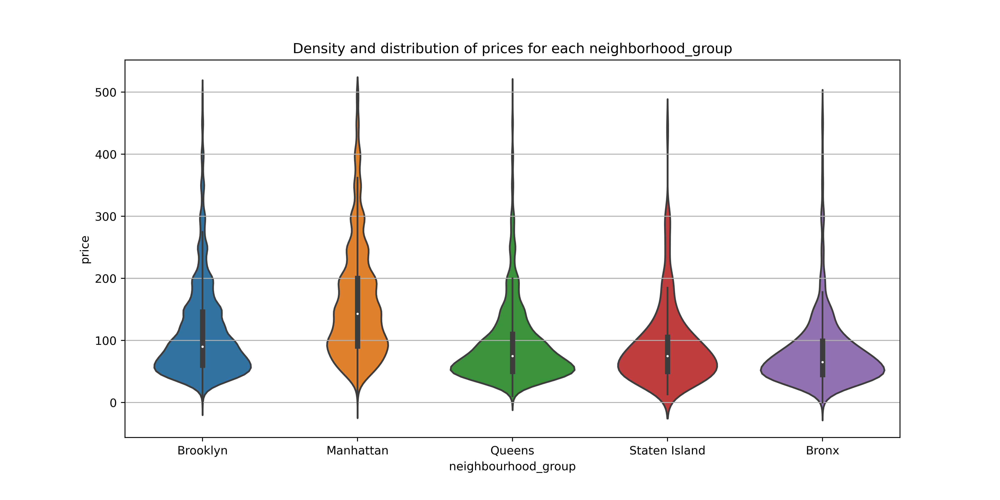

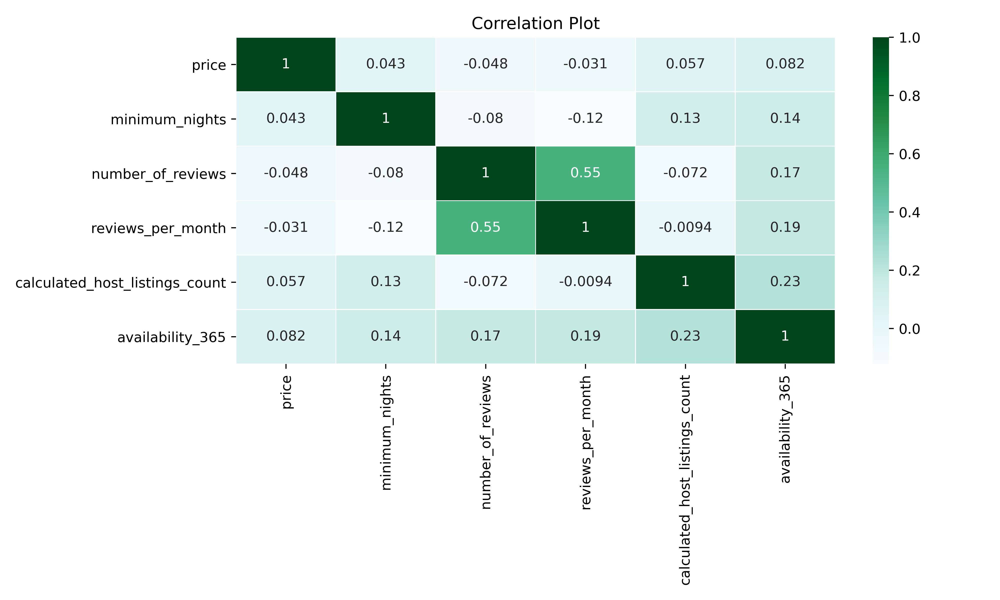

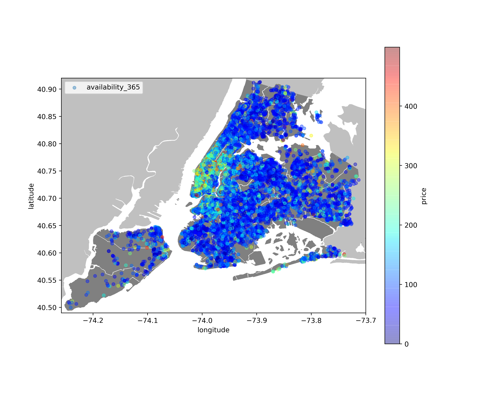

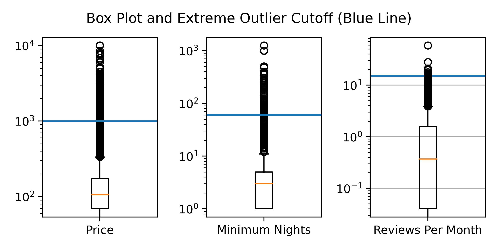

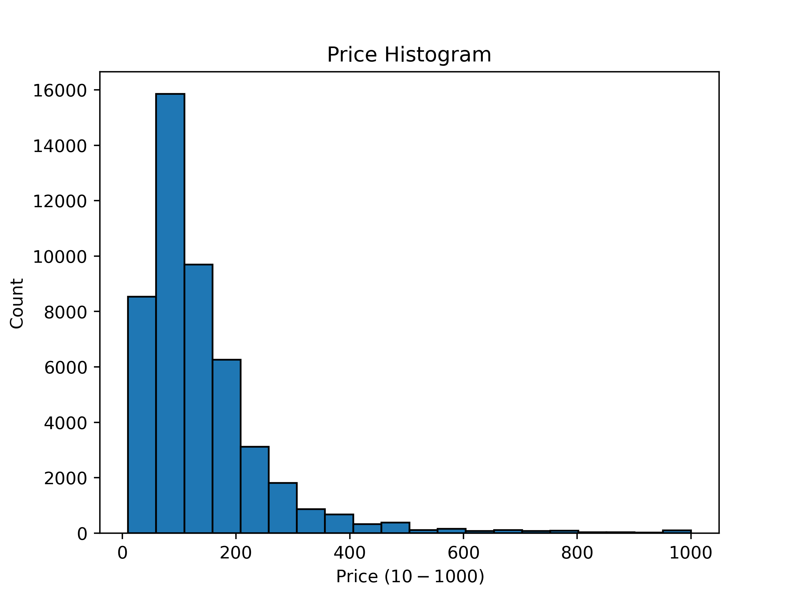

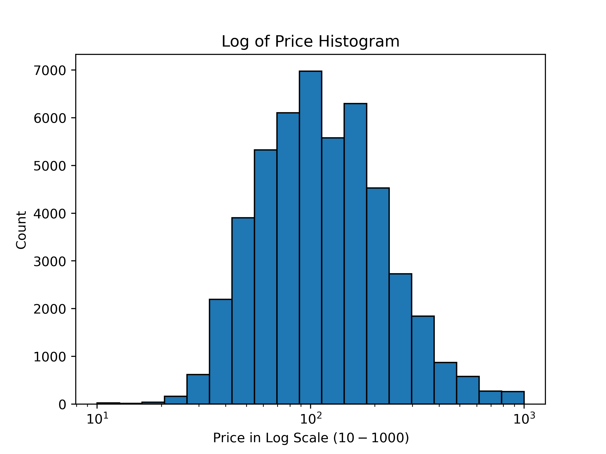

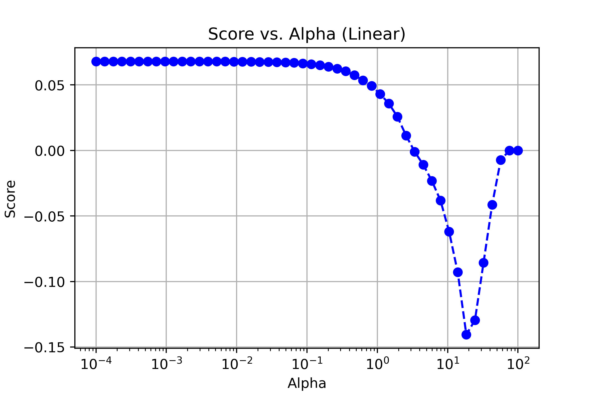

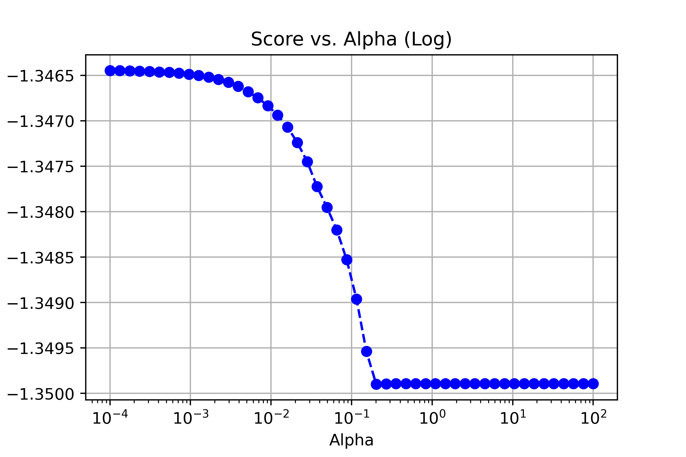

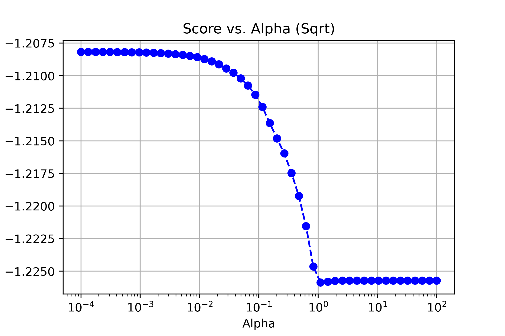

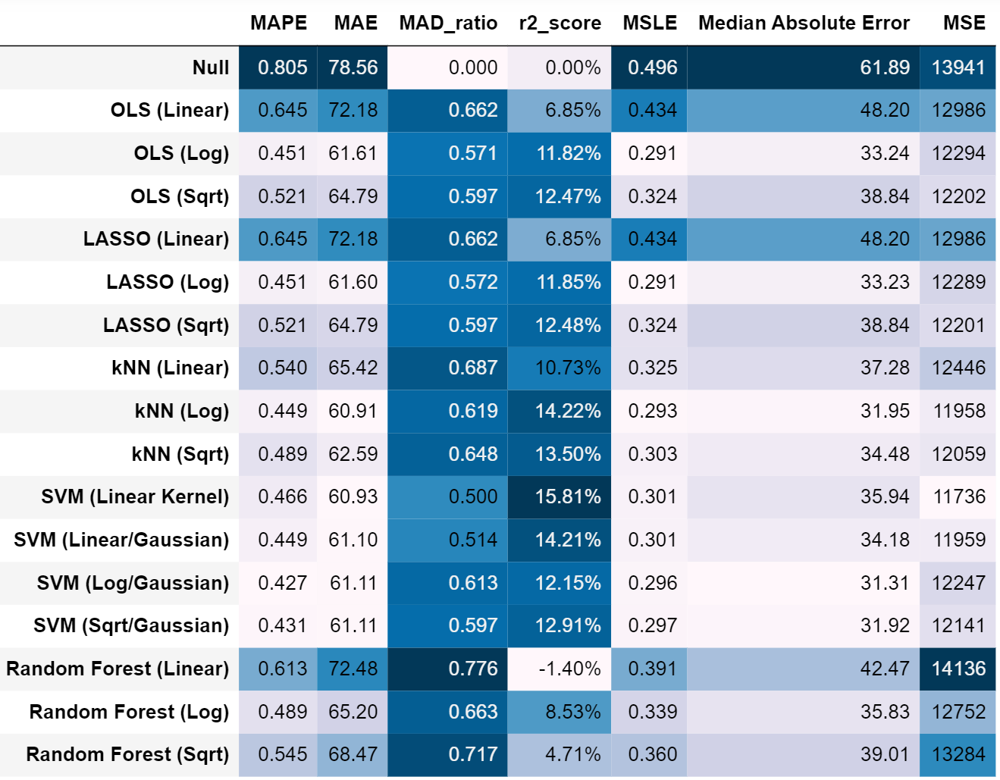

## 8.1 Median Absolute Error

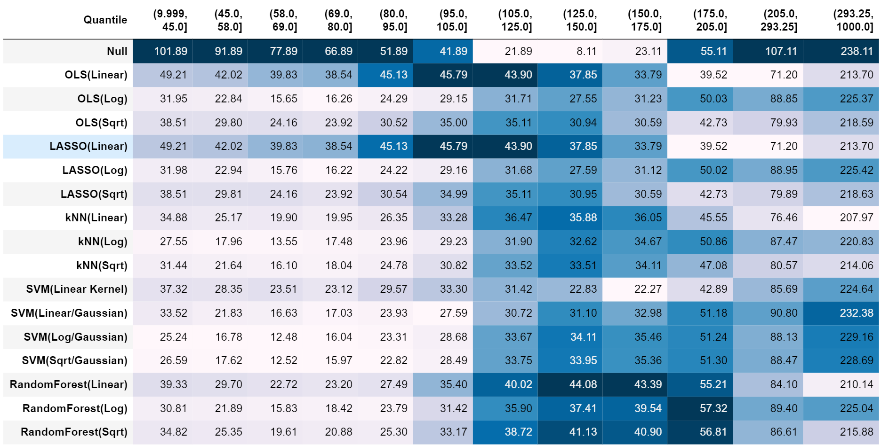

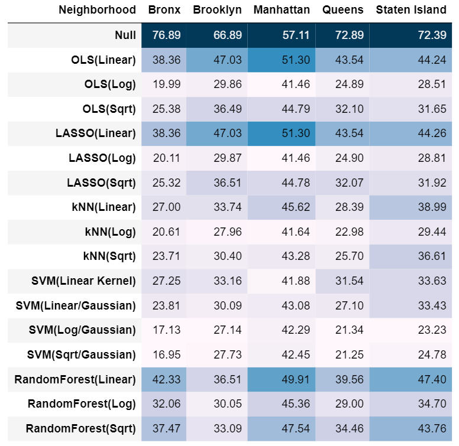

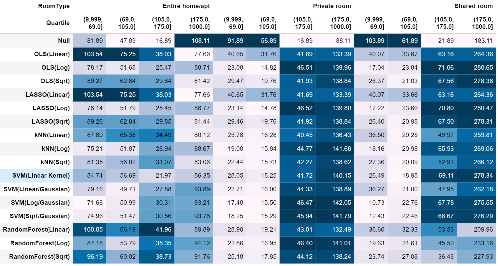

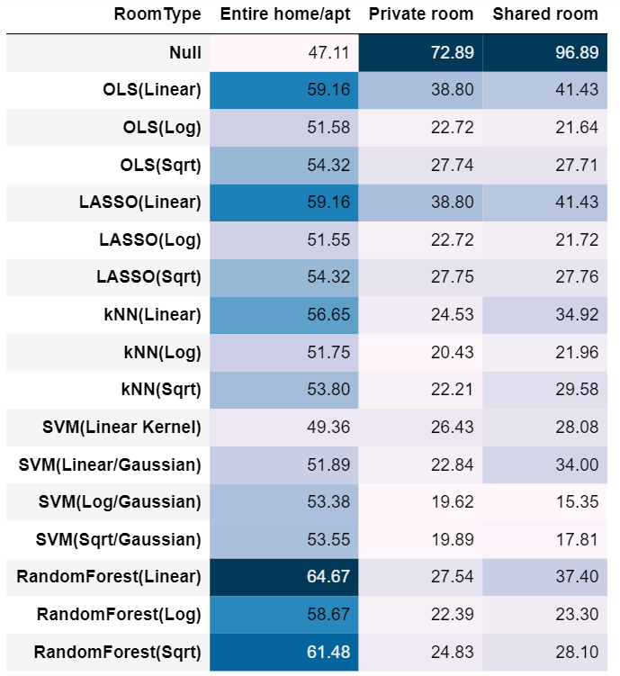

## 8.2 Feature Importance

.png)

.png)

.png)

.png)

.png)

.png)

.png)

.png)

.png)

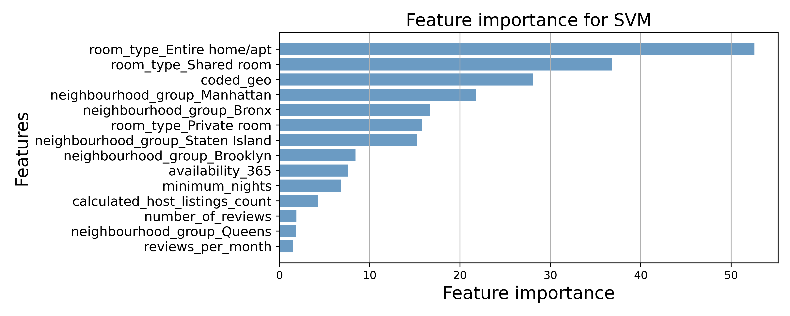

.png)

.png)

.png)

## 8.3 Price Category Boxplots

.png)
u
.png)

.png)

.png)

.png)

.png)

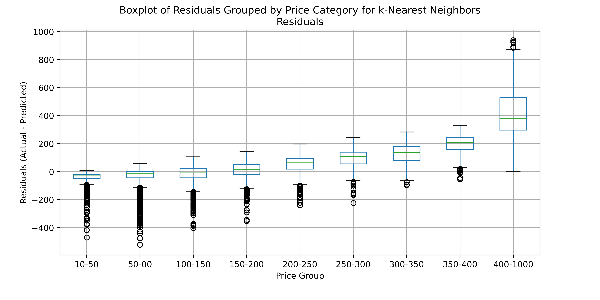

.png)

.png)

.png)

.png)

.png)

.png)

.png)

## 8.4 Actual Price vs Residual Price

_diff.png)

_diff.png)

_diff.png)

_diff.png)

_diff.png)

_diff.png)

_diff.png)

_diff.png)

_diff.png)

_diff.png)

_diff.png)

_diff.png)

_diff.png)

## 8.5 Actual Price vs Predicted Price

_actual.png)

_actual.png)

_actual.png)

_actual.png)

_actual.png)

_actual.png)

_actual.png)

_actual.png)

_actual.png)

_actual.png)

_actual.png)

_actual.png)

_actual.png)

\clearpage

# 9. Supplementary Material

Airbnb_Project.ipynb file for all the analysis done in this project.
midterm_proj.Rmd file for data 
Airbnb_Project.py file for the code in the 'Airbnb_Project.ipynb' file
